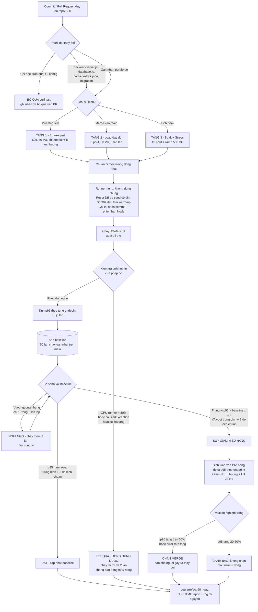

# 07 — Task 3: Mô hình kiểm thử hiệu năng liên tục (Disrupt · G9.6)

**MSSV:** 23127195 · **Ngày:** 2026-08-16

---

## 1. Vấn đề cần giải

Bài HW05 này chạy performance test **một lần, bằng tay**, mất khoảng 10 giờ. Cách đó không lặp lại được: đến commit kế tiếp của SUT thì mọi số liệu vừa đo đã hết hạn. Mục tiêu của phần này là mô tả một mô hình **tự động theo dõi commit của SUT, tự quyết định có cần chạy performance test hay không, và cảnh báo khi p95 xấu đi** — kèm phân tích cái giá phải trả.

Ba ràng buộc rút ra từ chính quá trình làm bài này, và mô hình phải xử lý được cả ba:

1. **Dữ liệu tích luỹ làm sai lệch phép đo.** Đã đo được: 21.404 đơn tồn đọng làm throughput tụt 2,17 lần. Nếu pipeline không reset DB về trạng thái cố định thì mỗi lần chạy đo một hệ thống khác nhau.
2. **Máy sinh tải có thể chính là nút thắt.** 15,82% "lỗi" trong calibration hoá ra là `BindException` phía client. Pipeline **bắt buộc** phải giám sát cả tài nguyên của runner, nếu không nó sẽ báo động nhầm.
3. **Một lần chạy đơn lẻ quá nhiễu để kết luận.** Ngưỡng cứng kiểu "p95 > 200 ms thì fail" sẽ vừa báo động giả liên tục, vừa bỏ lọt suy giảm từ từ.

---

## 2. Sơ đồ luồng



---

## 3. Từng khối quyết định — và lý do

### 3.1 Bộ phân loại thay đổi (khối B)

Không phải commit nào cũng đáng chạy performance test. Quy tắc dựa trên đường dẫn file:

| Đường dẫn thay đổi | Hành động | Lý do |
|---|---|---|
| `backend/server.js`, `backend/database.js` | **Chạy** | Nơi duy nhất chứa logic xử lý request và truy vấn DB |
| `backend/package-lock.json` | **Chạy** | Nâng cấp thư viện là nguồn suy giảm hiệu năng âm thầm điển hình |
| File migration / schema | **Chạy** | Thêm/bớt index đổi hoàn toàn đặc tính hiệu năng |
| `frontend-*/**`, `*.md`, `.github/**` | **Bỏ qua** | Không chạm backend API |
| Có nhãn `perf:force` | **Chạy** | Cửa thoát thủ công cho người review |

Riêng nhánh `main` **luôn** chạy theo lịch đêm, bất kể có commit hay không — để bắt suy giảm đến từ môi trường (nâng cấp Node, đổi image runner) chứ không từ mã nguồn.

### 3.2 Ba tầng kiểm thử (khối E/F/G)

Chạy full load test cho mọi PR là quá đắt. Chia tầng theo mức độ cam kết:

| Tầng | Khi nào | Cấu hình | Thời gian | Bắt được gì | Bỏ lọt gì |
|---|---|---|---|---|---|
| **1 — Smoke perf** | Mỗi PR | 30 VU, 60 s | ~2 phút | Suy giảm thô bạo (query N+1, mất index, thêm lệnh gọi đồng bộ) | Rò rỉ, suy giảm nhỏ |
| **2 — Load đầy đủ** | Merge vào `main` | 60 VU, 5 phút, lặp 3 lần | ~18 phút | Suy giảm p95 từ 20% trở lên, có ý nghĩa thống kê | Vấn đề chỉ lộ sau nhiều giờ |
| **3 — Soak + Stress** | Hằng đêm | 150 VU × 15 phút, ramp 500 VU | ~25 phút | Rò rỉ bộ nhớ, suy giảm do dữ liệu tích luỹ, dịch chuyển điểm gãy | — |

### 3.3 Chuẩn bị môi trường đồng nhất (khối H1)

Đây là khối mà **nếu làm sai thì cả pipeline vô nghĩa**, và bài này đã có bằng chứng số cụ thể cho từng điểm:

- **Reset DB về seed cố định trước mỗi lần chạy.** Bằng chứng: 0 đơn → 652 sample/s; 21.404 đơn → 301 sample/s. Không reset thì đang đo khối lượng dữ liệu chứ không đo mã nguồn.
- **Runner riêng, không chạy chung với job khác.** CI runner dùng chung là nguồn nhiễu lớn nhất của mọi pipeline hiệu năng.
- **Bỏ 30 giây đầu.** Node cần thời gian JIT warm-up; trong lần chạy Load, cửa sổ 60 s đầu chỉ đạt 33,8 req/s so với 69,6 req/s ở trạng thái ổn định — gộp vào sẽ kéo tụt trung bình một cách giả tạo.
- **Ghi lại hash commit của SUT, phiên bản Node, phiên bản JMeter, model CPU.** Không có mấy thứ này thì baseline so sánh giữa hai môi trường khác nhau.

### 3.4 Cổng kiểm tra tính hợp lệ của phép đo (khối J) — điểm khác biệt chính

Hầu hết pipeline hiệu năng đi thẳng từ "chạy xong" sang "so sánh ngưỡng". Mô hình này chèn thêm một cổng ở giữa, sinh ra trực tiếp từ sai lầm gặp phải trong bài:

```
NEU  tim thay "BindException" hoac "Address already in use" trong .jtl
HOAC CPU cua tien trinh sinh tai > 80% mot nhan
HOAC bo nho kha dung cua runner < 500 MB
THI  danh dau lan chay la KHONG DUNG DUOC, chay lai (toi da 2 lan)
     va TUYET DOI khong bao suy giam hieu nang
```

Nếu không có cổng này, lần calibration 100 VU trong bài sẽ bị pipeline báo cáo thành "tỉ lệ lỗi 15,82%, hiệu năng suy giảm nghiêm trọng" — trong khi SUT hoàn toàn khoẻ mạnh. **Lỗi của công cụ đo không bao giờ được phép trở thành cảnh báo về sản phẩm.**

### 3.5 Phát hiện suy giảm (khối N)

Ngưỡng cứng là sai lầm. Thay vào đó dùng baseline động:

- **Baseline** = trung bình và độ lệch chuẩn của p95 trên **50 lần chạy gần nhất của `main`**, tính riêng cho từng endpoint.
- **Cảnh báo** khi thoả **đồng thời hai điều kiện**:
  1. `p95_trung_vi > baseline_p95 × 1,20` — ý nghĩa thực tiễn (đủ lớn để người dùng cảm nhận được);
  2. `p95_trung_vi > baseline_trung_bình + 3 × độ_lệch_chuẩn` — ý nghĩa thống kê (không phải nhiễu).
- **Xác nhận 2 trong 3:** một lần chạy vượt ngưỡng chỉ bị đánh dấu *nghi ngờ* và kích hoạt chạy thêm 2 lần; chỉ khi trung vị của 3 lần vẫn vượt mới báo động. Cách này cắt phần lớn báo động giả với chi phí tăng thêm chỉ ở những lần thực sự đáng ngờ.

Ngưỡng riêng theo nhóm endpoint, vì mức nhiễu tự nhiên khác nhau — số liệu lấy từ chính lần chạy Load của bài này:

| Nhóm endpoint | p95 đường cơ sở đo được | Ngưỡng cảnh báo (×1,2) |
|---|---|---|
| Auth-heavy (`POST /api/login`) | 7 ms | 8,4 ms |
| Read-heavy (`GET /api/products?search`) | 7 ms | 8,4 ms |
| Read-heavy (`GET /api/products/{id}`) | 7 ms | 8,4 ms |
| Transactional (`POST /api/checkout`) | 15 ms | 18 ms |
| Transactional (`POST /api/cart`) | 4 ms | 4,8 ms |

> Ở giá trị tuyệt đối vài mili-giây, sai số đo lấn át. Trong thực tế nên đặt thêm **sàn tuyệt đối** (ví dụ bỏ qua chênh lệch dưới 5 ms) để tránh báo động vì nhiễu của đồng hồ.

---

## 4. Đánh đổi

### 4.1 Chi phí

| Hạng mục | Ước tính | Ghi chú |
|---|---|---|
| Smoke perf mỗi PR | ~2 phút runner | Với 30 PR/tuần ≈ 1 giờ/tuần |
| Load đầy đủ mỗi lần merge | ~18 phút (3 lần lặp) | Với 15 merge/tuần ≈ **4,5 giờ/tuần** — hạng mục tốn nhất |
| Soak + Stress hằng đêm | ~25 phút/đêm | ≈ 3 giờ/tuần |
| Lưu trữ artefact | ~120 MB/lần chạy | `.jtl` thô của bài này: Load 3,4 MB nhưng Stress/Spike lớn hơn nhiều; giữ 90 ngày |
| **Tổng** | **≈ 8,5 giờ runner/tuần** | Cần runner riêng, không dùng chung |

**Cách giảm chi phí, xếp theo hiệu quả:**

1. **Lọc theo đường dẫn** — thực tế phần lớn commit chỉ chạm frontend/docs; ước tính cắt được 50–70% số lần chạy.
2. **Giảm 3 lần lặp xuống 1 lần, chỉ lặp khi nghi ngờ.** Cắt chi phí tầng 2 xuống 1/3, đổi lại chậm phát hiện một chút.
3. **Gộp merge:** chạy tầng 2 theo lô mỗi 30 phút thay vì mỗi merge. Nếu lô bị cảnh báo thì mới bisect trong lô.
4. Hạ tầng 3 xuống 2 đêm/tuần nếu ngân sách chặt — nhưng đây là tầng **duy nhất** bắt được rò rỉ bộ nhớ, cắt sau cùng.

### 4.2 Báo động giả

| Nguồn báo động giả | Cách xử lý trong mô hình | Rủi ro còn lại |
|---|---|---|
| Runner dùng chung / hàng xóm ồn ào | Runner riêng + cổng kiểm tra tính hợp lệ (khối J) | Nhiễu ở tầng ảo hoá vẫn không loại hết được |
| Công cụ đo cạn tài nguyên | Chặn theo dấu hiệu `BindException` / CPU client | Có thể xuất hiện dạng cạn tài nguyên khác chưa liệt kê |
| JIT warm-up | Bỏ 30 s đầu | Nếu thời gian chạy quá ngắn thì cắt warm-up làm mẫu còn quá ít |
| Dữ liệu tích luỹ | Reset DB về seed cố định | Seed cố định che mất vấn đề chỉ lộ ở quy mô dữ liệu lớn — bù bằng tầng 3 dùng seed lớn |
| Nhiễu tự nhiên của một lần chạy | Xác nhận 2 trong 3 + baseline động 3σ | Tăng độ trễ phát hiện |

### 4.3 Bỏ lọt (nguy hiểm hơn báo động giả)

- **Suy giảm từ từ:** mỗi commit làm chậm 3%, nằm dưới ngưỡng 20%, nhưng 10 commit thì thành 34%. Baseline động sẽ *hấp thụ* mức trôi này vì baseline tự cập nhật theo. **Cách chống:** thêm một cảnh báo xu hướng dài hạn — so p95 hiện tại với baseline của **90 ngày trước**, chứ không chỉ với 50 lần chạy gần nhất.
- **Vấn đề chỉ lộ ở quy mô dữ liệu thật:** seed cố định nhỏ sẽ không bao giờ bộc lộ việc thiếu index trên `orders.user_id`. Tầng 3 vì thế phải dùng seed lớn (ví dụ 500.000 đơn) chứ không phải seed sạch.
- **Rò rỉ chỉ lộ sau nhiều giờ:** soak 15 phút không bắt được thứ cần 6 giờ mới lộ. Chấp nhận đánh đổi này, bù bằng giám sát hiệu năng trên môi trường thật (APM).

---

## 5. Vì sao mô hình này khác các pipeline hiệu năng thông thường

Ba điểm dưới đây đều **sinh ra từ sai lầm thực tế đã mắc trong bài này**, chứ không phải chép từ thực hành chung:

1. **Cổng kiểm tra tính hợp lệ của phép đo đặt TRƯỚC bước so sánh ngưỡng.** Phần lớn pipeline mặc định "chạy xong là số liệu dùng được". Bài này đã có một trường hợp mà giả định đó dẫn tới kết luận sai hoàn toàn về SUT.
2. **Reset dữ liệu được coi là một phần của phép đo, không phải việc dọn dẹp.** Có con số 2,17 lần để chứng minh.
3. **Pipeline tự giám sát chính nó.** Tài nguyên của máy sinh tải được ghi lại cùng hạng với tài nguyên của SUT, và được đưa vào tiêu chí chặn.

---

## 6. Lộ trình triển khai

| Giai đoạn | Việc làm | Kết quả cần đạt |
|---|---|---|
| 1 (tuần 1) | Đóng gói `run_scenario.ps1` + `analyze_jtl.py` thành container; chạy tay trên CI runner | Một lần chạy tái lập được |
| 2 (tuần 2) | Thêm bộ lọc theo đường dẫn + tầng 1 smoke perf cho PR | Có phản hồi ở mỗi PR |
| 3 (tuần 3) | Kho baseline (SQLite hoặc bảng time-series) + cổng kiểm tra tính hợp lệ | Phát hiện suy giảm có thống kê |
| 4 (tuần 4) | Tầng 2 + tầng 3 theo lịch, bình luận tự động vào PR | Vận hành đầy đủ |
| 5 | Cảnh báo xu hướng 90 ngày | Bắt được suy giảm trôi từ từ |
